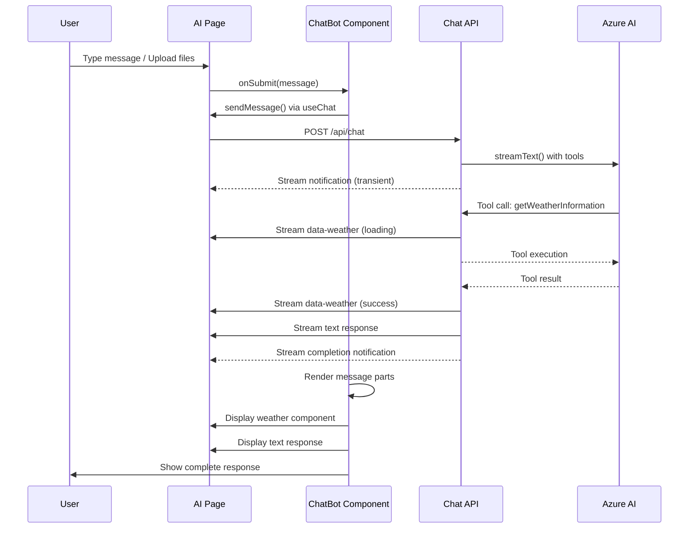
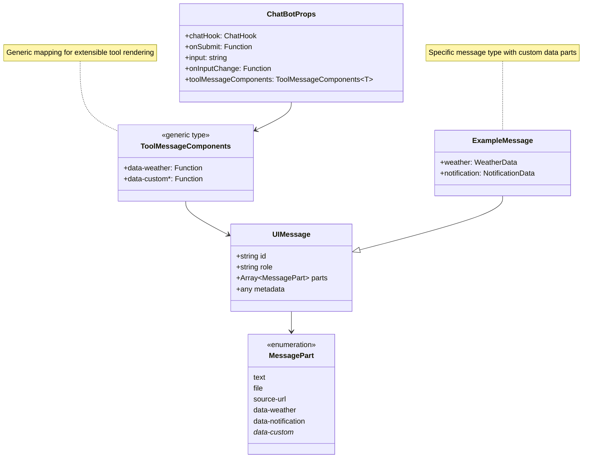
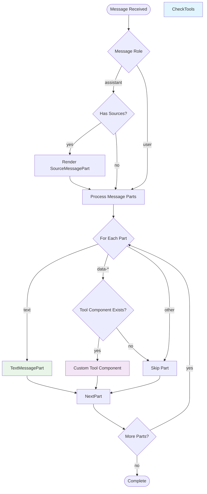

# Chatbot Architecture Documentation

## Overview

This document provides a comprehensive analysis of the chatbot system built with React, TypeScript, and the AI SDK. The architecture demonstrates a modern approach to building extensible chatbot interfaces with real-time streaming capabilities and custom tool integration.

## Core Components

### 1. ChatBot Component (`src/components/ai/chatbot.tsx`)
The main reusable chatbot component that provides:
- Generic type support for different message types
- Extensible tool message component system
- Message rendering with text, sources, and custom data parts
- Integration with input handling and conversation display

### 2. AI Page (`src/app/(ai)/ai/page.tsx`)
Page-level implementation that:
- Configures the chatbot with specific settings
- Manages chat state using `useChat` hook
- Handles message submission and file uploads
- Provides custom tool component implementations

### 3. Chat API Route (`src/app/(ai)/api/chat/route.ts`)
Server-side API that:
- Handles streaming responses using AI SDK
- Implements tool execution with data streaming
- Provides real-time updates and notifications
- Manages conversation flow and AI model integration

## Architecture Diagrams

### Component Architecture

```mermaid
graph TB
    subgraph "Frontend (Client Side)"
        AIPage[AI Page<br/>src/app/(ai)/ai/page.tsx]
        ChatBot[ChatBot Component<br/>src/components/ai/chatbot.tsx]

        subgraph "AI Elements"
            Conv[Conversation<br/>conversation.tsx]
            Prompt[PromptInput<br/>prompt-input.tsx]
            MsgParts[Message Parts<br/>message-parts.tsx]
            Empty[Empty State<br/>empty-state.tsx]
        end

        subgraph "Tool Components"
            WeatherTool[Weather Tool<br/>data-weather component]
            CustomTools[Custom Tool Components]
        end
    end

    subgraph "Backend (Server Side)"
        API[Chat API Route<br/>src/app/(ai)/api/chat/route.ts]

        subgraph "AI Services"
            Azure[Azure AI Service]
            Model[GPT-4 Mini Model]
        end
    end

    AIPage --> ChatBot
    ChatBot --> Conv
    ChatBot --> Prompt
    ChatBot --> MsgParts
    ChatBot --> Empty
    ChatBot --> WeatherTool
    ChatBot --> CustomTools

    AIPage -.->|HTTP Request| API
    API -.->|Streaming Response| AIPage
    API --> Azure
    Azure --> Model
```

### Data Flow Architecture



### Type System Architecture



### Message Part Processing Flow



### File Upload & Attachment Flow

```mermaid
stateDiagram-v2
    [*] --> InputReady

    InputReady --> FileSelected: User selects files
    FileSelected --> ValidateFiles: Check file types/sizes
    ValidateFiles --> FileRejected: Validation fails
    ValidateFiles --> CreateBlobUrls: Validation passes

    CreateBlobUrls --> PreviewFiles: Show previews
    PreviewFiles --> MoreFiles: Add more files?
    MoreFiles --> FileSelected: Yes
    MoreFiles --> ReadyToSubmit: No

    FileRejected --> InputReady: User can retry
    ReadyToSubmit --> ConvertToDataUrl: Form submitted

    ConvertToDataUrl --> SubmitToAPI: Async conversion
    SubmitToAPI --> ClearAttachments: Submission complete
    ClearAttachments --> InputReady

    note right of ConvertToDataUrl: "Convert blob:// URLs to data:// URLs for API transmission"
```

## Technical Implementation Details

### Generic Type System

The chatbot uses a sophisticated generic type system that enables type-safe extensibility:

```typescript
// Generic tool message component mapping
export type ToolMessageComponents<T extends UIMessage<any, any>> = {
  [K in Extract<T['parts'][number]['type'], `data-${string}`>]?: (
    message: T,
    part: Extract<T['parts'][number], { type: K }>
  ) => React.ReactNode;
};

// Generic ChatBot component
const ChatBot = <T extends UIMessage<any, any>>(props: ChatBotProps<T>) => {
  // Component implementation with full type safety
}
```

**Key Benefits:**
- **Type Safety**: TypeScript ensures only valid data part types can be handled
- **Extensibility**: New tool components can be added without modifying core code
- **IntelliSense**: IDE support for available tool component types
- **Runtime Safety**: Components only receive expected data structures

### Message Part Processing

The system processes different types of message parts:

1. **Text Parts**: Standard text messages with regeneration and copy actions
2. **Source URL Parts**: Reference links with collapsible source display
3. **Data Parts**: Custom tool outputs (weather, notifications, etc.)

```typescript
// Part rendering logic in ChatBot component
{message.parts.map((part, partIndex) => {
  // Handle text parts internally
  if (part.type === "text") {
    return <TextMessagePart key={...} message={message} part={part} />;
  }

  // Handle tool message components from parent
  if (toolMessageComponents && part.type in toolMessageComponents) {
    const ToolComponent = toolMessageComponents[part.type];
    return <Fragment key={...}>{ToolComponent(message, part)}</Fragment>;
  }

  return null;
})}
```

### Streaming Architecture

The system implements advanced streaming capabilities:

```typescript
// Server-side streaming with data parts
const stream = createUIMessageStream<ExampleMessage>({
  execute: ({ writer }) => {
    // 1. Initial notification (transient)
    writer.write({
      type: "data-notification",
      data: { message: "Processing...", level: "info" },
      transient: true, // Won't be added to message history
    });

    // 2. Execute AI model with tools
    const result = streamText({
      model: azure("gpt-4o-mini"),
      tools: {
        getWeatherInformation: {
          description: "Show weather for a city",
          execute: async ({ city }) => {
            // 3. Send loading state
            writer.write({
              type: "data-weather",
              id: "weather-1",
              data: { city, status: "loading" },
            });

            // 4. Simulate API call
            const weather = await getWeather(city);

            // 5. Update with result (reconciliation)
            writer.write({
              type: "data-weather",
              id: "weather-1", // Same ID = update existing part
              data: { city, weather, status: "success" },
            });

            return weather;
          },
        },
      },
    });

    writer.merge(result.toUIMessageStream());
  },
});
```

**Key Streaming Features:**
- **Transient Messages**: Status updates that don't persist in history
- **Data Part Reconciliation**: Updates to existing parts using matching IDs
- **Real-time Updates**: Loading states and progress indicators
- **Tool Integration**: Seamless tool execution within streaming context

### State Management

The chatbot uses the AI SDK's `useChat` hook for state management:

```typescript
const chatHook = useChat<ExampleMessage>({
  transport: new DefaultChatTransport({
    api: "/api/chat",
  }),
  onData: (dataPart) => {
    // Handle real-time data notifications
    if (dataPart.type === "data-notification") {
      toast(dataPart.data.message);
    }
  },
});
```

**State Features:**
- **Automatic Message History**: Built-in conversation persistence
- **Streaming Status**: Loading, error, and completion states
- **File Upload Support**: Native attachment handling
- **Error Handling**: Graceful failure recovery

## Extensibility Patterns

### Adding New Tool Components

1. **Define Data Part Type** (in API route):
```typescript
export type ExampleMessage = UIMessage<never, {
  weather: { city: string; weather?: string; status: "loading" | "success" };
  customTool: { /* custom data structure */ };
}>;
```

2. **Implement Tool in API**:
```typescript
tools: {
  customTool: {
    description: "Description of what the tool does",
    inputSchema: z.object({ /* input validation */ }),
    execute: async (params) => {
      writer.write({
        type: "data-customTool",
        id: "tool-1",
        data: { /* initial data */ },
      });

      const result = await performOperation(params);

      writer.write({
        type: "data-customTool",
        id: "tool-1", // Same ID for updates
        data: { /* updated data */ },
      });

      return result;
    },
  },
}
```

3. **Create React Component**:
```typescript
const CustomToolComponent = (message, part) => (
  <Fragment>
    <Message from={message.role}>
      <MessageContent>
        {/* Render custom tool UI based on part.data */}
      </MessageContent>
    </Message>
  </Fragment>
);
```

4. **Register Component**:
```typescript
<ChatBot
  toolMessageComponents={{
    "data-customTool": CustomToolComponent,
  }}
/>
```

### File Upload Extensions

The file upload system can be extended with:

1. **Custom File Validators**:
```typescript
const matchesCustomFormat = (f: File) => {
  // Custom validation logic
  return f.type.startsWith("application/custom");
};
```

2. **File Preview Components**:
```typescript
const CustomFilePreview = ({ data }) => (
  <div className="custom-preview">
    {/* Custom preview UI */}
  </div>
);
```

3. **Upload Handlers**:
```typescript
const handleCustomUpload = async (files: FileUIPart[]) => {
  // Custom upload logic (e.g., to S3, Cloudinary, etc.)
};
```

### UI Customization Points

1. **Message Styling**: Customize `MessageContent` variants
2. **Input Components**: Extend `PromptInput` with custom tools
3. **Empty States**: Replace default empty state with custom content
4. **Loading Indicators**: Custom loader components
5. **Action Buttons**: Add custom message actions

## Key Dependencies

### Core Libraries
- **AI SDK**: `@ai-sdk/react`, `ai` - Chat functionality and streaming
- **Azure AI**: `@ai-sdk/azure` - Model integration
- **React**: UI framework with hooks and context
- **TypeScript**: Type safety and IntelliSense
- **Tailwind CSS**: Styling and design system

### UI Components
- **Lucide React**: Icons and interface elements
- **Radix UI**: Accessible component primitives
- **Streamdown**: Markdown rendering with streaming support
- **Sonner**: Toast notifications
- **Class Variance Authority**: Component variant system

### Supporting Libraries
- **Nanoid**: Unique ID generation
- **Zod**: Schema validation
- **Use Stick to Bottom**: Auto-scroll conversation

## Performance Considerations

### Optimization Strategies
1. **Message Virtualization**: For large conversation histories
2. **File Upload Limits**: Prevent oversized uploads
3. **Debounced Input**: Reduce API call frequency
4. **Component Memoization**: Prevent unnecessary re-renders
5. **Stream Buffering**: Optimize streaming performance

### Memory Management
1. **Blob URL Cleanup**: Revoke object URLs after use
2. **Message History Limits**: Optional conversation truncation
3. **Component Unmounting**: Proper cleanup on navigation
4. **Error Boundaries**: Prevent crash propagation

## Security Considerations

### File Upload Security
1. **File Type Validation**: Server-side verification
2. **Size Limits**: Prevent resource exhaustion
3. **Content Scanning**: Malware detection integration
4. **Access Control**: User permission validation

### API Security
1. **Rate Limiting**: Prevent abuse
2. **Input Sanitization**: Clean user inputs
3. **Authentication**: Secure API access
4. **CORS Configuration**: Proper cross-origin setup

## Best Practices

### Development Guidelines
1. **Type Safety**: Use TypeScript generics for extensibility
2. **Component Composition**: Build reusable, composable components
3. **Error Handling**: Graceful failure recovery
4. **Accessibility**: WCAG compliance for all interactions
5. **Testing**: Unit tests for tool components and API routes

### Code Organization
1. **Separation of Concerns**: Clear UI vs. API boundaries
2. **Reusable Patterns**: Consistent tool component structure
3. **Documentation**: Clear prop types and usage examples
4. **Version Control**: Semantic versioning for breaking changes

This architecture provides a solid foundation for building sophisticated, extensible chatbot interfaces with real-time capabilities and modern web development best practices.